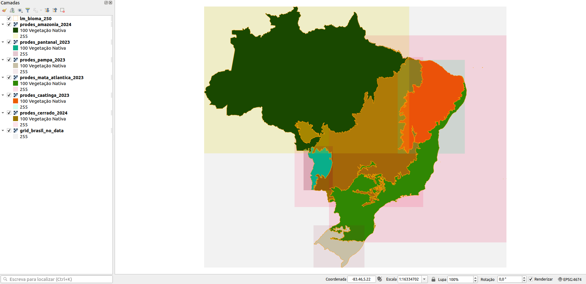
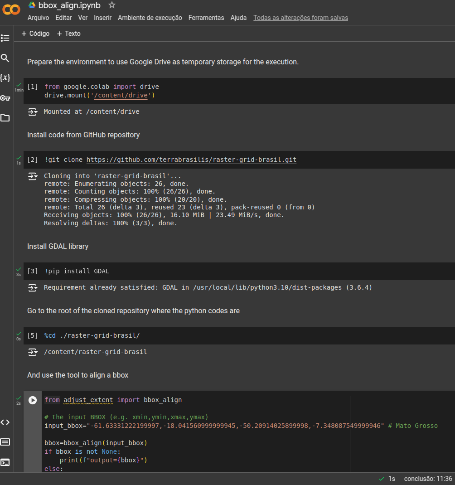

## Raster grid Brasil

This tool is a simple function that takes an input bounding box and outputs the bounding box aligned using a reference grid.

To do this, we propose a reference raster grid for the extent of Brazil, to allow the alignment of any input extent coordinates, as a bounding box, which represents an area within the extents of the reference grid. The expected result is that the subgrid maintains alignment with any other subgrids created with the same resolution and the bbox aligned using this tool, as illustrated in the print screen below.




### Using the aligned bbox

The aligned bounding box obtained using this tool is as expected by the gdal_rasterize command, as shown in the example below.

```sh
# the aligned bbox from "align_arbitrary_bbox.py"
BBOX="-61.63338215899995 -18.041499166999966 -50.20914215899995 -7.348059166999967"
PIXEL_SIZE="0.00009 0.00009"
TB_NAME="name_of_the_table_where_the_vector_data_is"
PGCONNECTION="dbname='${DB_NAME}' host=${host} port=${port} user='${user}' password='${PGPASSWORD}'"
OUTPUT="/path/to/output/output_file_name"

gdal_rasterize -tr ${PIXEL_SIZE} \
    -te ${BBOX} \
    -a_nodata 255 -co "COMPRESS=LZW" \
    -ot Byte PG:"${PGCONNECTION}" \
    -a "class_number" \
    -sql "SELECT class_number, geom FROM public.burn_${TB_NAME}" "${OUTPUT}.tif"
```

### Identification of available items

In the "assets/" directory we have:

 - A compressed file named "grid_brasil_no_data.zip", with the reference grid, in GeoTiff format, ready for use;
 - A compressed file named "lm_bioma_250.zip", with the limits of the biomes of Brasil, in GeoPackage format;
 - Some image files to use as ilustrations of notes;

In the "grid-file-build/" directory we have:

 - A tool, in bash-compatible shell script, to create the reference grid, if necessary;
 - Two files, "start.sh" and "run-grid-file-build.sh", in bash-compatible shell script, which can be used if the execution option is Docker, see details in [README.md](grid-file-build/README.md) file;

In the root directory we have:

 - A tool provided in the file "adjust_extent.py", in python language compatible with python 3, to perform the calculation of the adjustment of an input box, using the reference grid;
 - A test script provided in the file "align_bbox_example.py", in python language compatible with python 3, to demonstrate the use of the calculation tool, using the biomes file as a base;
 - A Jupyter Notebook, 


### How to use the tools?

This section is about running the following tools:

 - a reference grid generator, detailed in the **To generate the reference grid** section;
 - a bbox aligner, detailed in the **To align arbitrary bbox** section;
 - an example of bbox alignment, detailed in the **To align the bbox of biomes** section;


#### About the environment


Before using this, you need to have python with GDAL installed on your system, use Docker environment or jupyter notebook as example in Google Colab.

The versions used in the tests are:

| name | value |
|------|-------|
| Python | 3.8.x |
| GDAL | 3.0.4 |


#### To align arbitrary bbox

A bbox alignment tool is used to align any bbox you want if it is within the Brasil reference grid.

Assuming the runtime environment is configured on your system, edit the "align_arbitrary_bbox.py" file defining the desired input bbox.

```py
from adjust_extent import bbox_align

# the input BBOX (e.g. xmin,ymin,xmax,ymax)
input_bbox="-61.63331222199997,-18.041560999999945,-50.20914025899998,-7.348087549999946" # Mato Grosso

bbox=bbox_align(input_bbox)
if bbox is not None:
    print(f"output={bbox}")
else:
    print("Failed to adjust input BBOX.")
```

And run the script.

```sh
# in the command line
python3 align_arbitrary_bbox.py
```

Alternatively, you can use Jupyter Notebook in Colab or another supported cloud environment. You can use the [bbox_align.ipynb](bbox_align.ipynb) file to do this.



#### To align the bbox of biomes

An example of using the bbox alignment tool to obtain an aligned bbox for each biome in Brasil.

Assuming the runtime environment is set up, simply use the test script to get results for all biomes.

```sh
# in the command line
python3 align_bbox_example.py
```

And the results are:

```sh
biome=Amazônia
input=-73.983182159,-16.6620184999999,-43.399317927,5.26958083300003
output=-73.98318215899995 -16.661979166999966 -43.39938215899995 5.269580833000035
----------------------------------------------------------------------------------------------------
biome=Caatinga
input=-45.078141097,-16.7126366369999,-35.066981459,-2.74826396699996
output=-45.07815215899995 -16.712559166999966 -35.06700215899995 -2.7482491669999654
----------------------------------------------------------------------------------------------------
biome=Cerrado
input=-60.472595634,-24.681780126,-41.277535526,-2.33208833399993
output=-60.47265215899995 -24.681699166999966 -41.27754215899995 -2.3319991669999656
----------------------------------------------------------------------------------------------------
biome=Mata Atlântica
input=-55.334754825,-29.9812728009999,-28.8477703529999,0.91788715600007
output=-55.334822158999955 -29.98125916699997 -28.847822158999946 0.9179008330000347
----------------------------------------------------------------------------------------------------
biome=Pampa
input=-57.64957542,-33.7511779939999,-50.0526641929999,-27.461559511
output=-57.64962215899995 -33.75108916699997 -50.052722158999956 -27.461529166999966
----------------------------------------------------------------------------------------------------
biome=Pantanal
input=-59.1408334769999,-22.1615492629999,-54.793913082,-15.6468481049999
output=-59.14092215899995 -22.161519166999966 -54.79392215899995 -15.646779166999966
----------------------------------------------------------------------------------------------------
```

#### To generate the reference grid

If we need to generate the new reference grid, we can use the scripting tool to do so. Some reasons are to change the resolution from 10 meters to another, or to change the origin coordinates.

So, the first thing is to change the desired parameters inside the "generate_base_raster.sh" file.
The next step is to set up a runtime environment to run this tool, or use the recommended way described in the [README.md](grid-file-build/README.md) file.


## References

 - [GDAL for Python](https://pypi.org/project/GDAL/)
 - [Python ZipFile Library](https://docs.python.org/3.10/library/zipfile.html)
 - [Python SQLite3 library](https://docs.python.org/3.10/library/sqlite3.html)
 - [Google Colab](https://colab.research.google.com/)